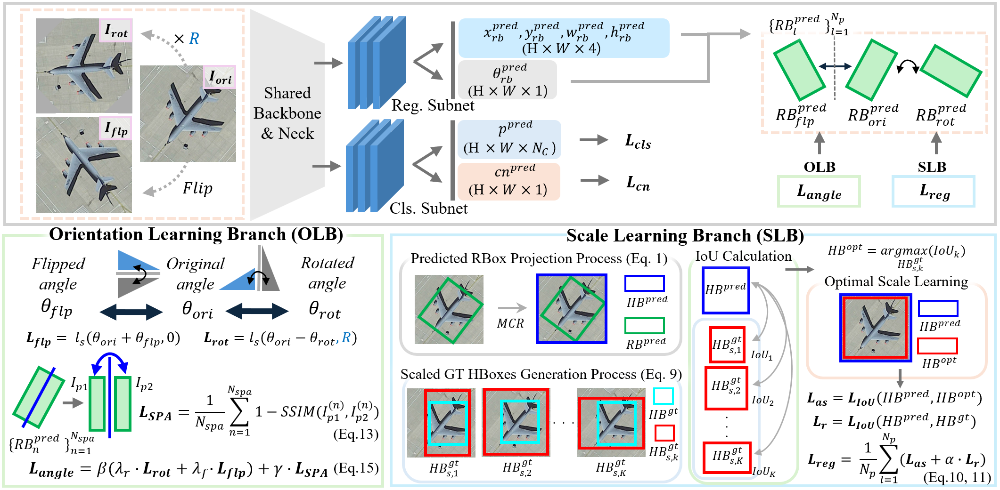

<div align="center">

  

  <div>&nbsp;</div>

  <div align="center">
    <b><font size="5">[CVPR 2025] ABBSPO: Adaptive Bounding Box Scaling and Symmetric Prior Based Orientation Prediction for Detecting Aerial Image Objects</font></b>
  </div>

  <div>&nbsp;</div>

  [📄 Paper](https://openaccess.thecvf.com/content/CVPR2025/papers/Lee_ABBSPO_Adaptive_Bounding_Box_Scaling_and_Symmetric_Prior_based_Orientation_CVPR_2025_paper.pdf) |
  [🌐 Project Page](https://kaist-viclab.github.io/ABBSPO_site/) |
  [📦 Checkpoints (TBA)](#-pretrained-models)

</div>

---

<p align="center">
  
</p>

<p align="center">
ABBSPO is a weakly supervised oriented object detection (WS-OOD) framework built upon H2RBox-v2.
It learns oriented bounding boxes (RBoxes) using only horizontal bounding boxes (HBoxes) via
<b>Adaptive Bounding Box Scaling (ABBS)</b> and a <b>Symmetric Prior Angle (SPA)</b> loss.
</p>

---

# 🗞️ News

- **Feb 2025** — Initial code release.  
- **Jan 2025** — Paper accepted to **CVPR 2025**.  
- **Coming soon** — Checkpoints for DIOR-R and DOTA-v1.0.

---

# ⚙️ Installation

## Option A — Install using pip & requirements.txt
```bash
git clone https://github.com/KAIST-VICLab/ABBSPO.git
cd ABBSPO

conda create -n abbspo python=3.8
conda activate abbspo

pip install -r requirements.txt
pip install -v -e .
